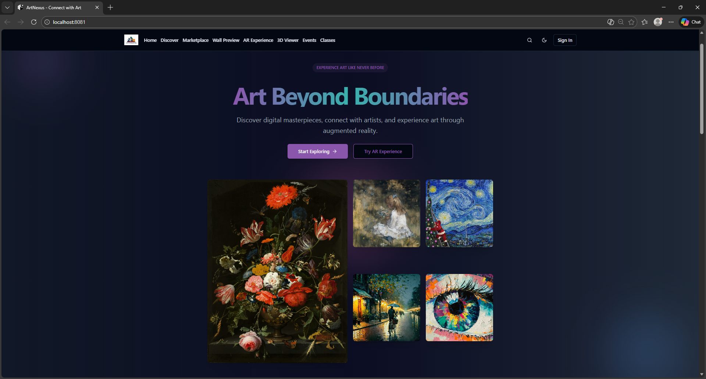
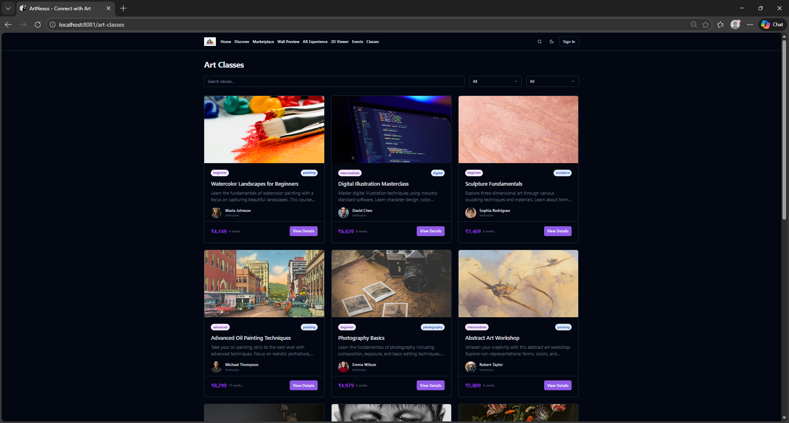

<div align="center">


# 🎨 ArtNexus

**A Modern Art Discovery, Marketplace & Augmented Reality Platform**

[](https://reactjs.org/)
[](https://www.typescriptlang.org/)
[](https://vitejs.dev/)
[](https://supabase.com/)
[](https://tailwindcss.com/)
[](LICENSE)

[🌐 Live Demo](#) &nbsp;·&nbsp; [🐛 Report Bug](../../issues/new?template=bug_report.md) &nbsp;·&nbsp; [✨ Request Feature](../../issues/new?template=feature_request.md)

</div>

---

## � About ArtNexus

**ArtNexus** is a full-stack web platform that connects artists, collectors, and art lovers through a seamless digital experience. It combines a beautiful artwork gallery, a real-money marketplace, live events, art classes, a community forum, and — most uniquely — an **Augmented Reality (AR) viewer** that lets you place artworks inside your physical room before buying.

Built with a modern React + TypeScript frontend powered by Supabase as a backend-as-a-service, ArtNexus is fast, responsive, and runs entirely in the browser with no separate backend server to manage.

---

## ✨ Features

- 🖼️ **Art Discovery** — Browse thousands of artworks with search and category filters
- 🛒 **Marketplace** — Buy and sell original artworks with a full shopping cart
- 🥽 **AR Viewer** — Place artworks in your room using WebXR Augmented Reality
- 🗂️ **Collections** — Create and curate personal art collections
- 👤 **Artist Profiles** — Portfolio pages for individual artists
- 🎭 **Events & Performances** — Discover upcoming art exhibitions and live shows
- 📚 **Art Classes** — Browse and enroll in online art courses
- 💬 **Community Forum** — Discuss and share with fellow art enthusiasts
- 🌙 **Dark / Light Mode** — Full theme support with system preference detection
- 🔐 **Authentication** — Secure sign-up/login via Supabase Auth

---

## 🛠️ Tech Stack

| Area | Technology |
|---|---|
| Framework | React 18 + TypeScript 5 |
| Build Tool | Vite 5 |
| Styling | Tailwind CSS 3 + shadcn/ui + Radix UI |
| Animation | Framer Motion |
| Routing | React Router v6 |
| Server State | TanStack React Query |
| Forms | React Hook Form + Zod |
| Backend | Supabase (PostgreSQL, Auth, Storage) |
| AR / 3D | @google/model-viewer + WebXR API |

---

## 📁 Project Structure

```
ArtNexus/
├── public/
│   ├── models/           # .glb 3D model files for AR viewing
│   └── lovable-uploads/  # Artwork thumbnail images
├── src/
│   ├── components/       # Reusable UI components
│   │   ├── ar/           # AR-specific components
│   │   └── ui/           # shadcn/ui base components
│   ├── contexts/         # React context (Auth, Cart)
│   ├── data/             # Static / mock data
│   ├── hooks/            # Custom React hooks
│   ├── integrations/     # Supabase client & types
│   ├── pages/            # Page-level route components
│   ├── App.tsx           # Root app with routing
│   └── main.tsx          # Entry point
├── .env.example          # Required environment variables
├── netlify.toml          # Netlify deployment config
├── vite.config.ts        # Vite configuration
└── package.json
```

---

## 🚀 Getting Started

### Prerequisites

- [Node.js](https://nodejs.org/) ≥ 18
- [npm](https://www.npmjs.com/) ≥ 8
- A free [Supabase](https://supabase.com/) account

### 1. Clone & Install

```bash
git clone https://github.com/YOUR_USERNAME/ArtNexus.git
cd ArtNexus
npm install
```

### 2. Configure Environment Variables

```bash
cp .env.example .env
```

Edit `.env` and add your Supabase credentials:

```env
VITE_SUPABASE_URL=https://your-project-id.supabase.co
VITE_SUPABASE_ANON_KEY=your-anon-public-key
```

> Get these from: **Supabase Dashboard → Project Settings → API**

### 3. Set Up Supabase Database

Open the **SQL Editor** in your Supabase dashboard and run:

```sql
CREATE EXTENSION IF NOT EXISTS "uuid-ossp";

CREATE TABLE profiles (
  id UUID REFERENCES auth.users ON DELETE CASCADE PRIMARY KEY,
  username TEXT, avatar_url TEXT, bio TEXT, location TEXT, website TEXT,
  created_at TIMESTAMPTZ DEFAULT NOW(), updated_at TIMESTAMPTZ DEFAULT NOW()
);

CREATE TABLE artists (
  id UUID REFERENCES auth.users ON DELETE CASCADE PRIMARY KEY,
  name TEXT NOT NULL, bio TEXT, location TEXT, photo TEXT,
  verified BOOLEAN DEFAULT FALSE, created_at TIMESTAMPTZ DEFAULT NOW()
);

CREATE TABLE artworks (
  id UUID DEFAULT uuid_generate_v4() PRIMARY KEY,
  artist_id UUID REFERENCES artists(id) ON DELETE CASCADE,
  title TEXT NOT NULL, description TEXT, image TEXT NOT NULL,
  thumbnail TEXT, category TEXT[], price NUMERIC,
  for_sale BOOLEAN DEFAULT FALSE, likes INTEGER DEFAULT 0, views INTEGER DEFAULT 0,
  created_at TIMESTAMPTZ DEFAULT NOW(), updated_at TIMESTAMPTZ DEFAULT NOW()
);

CREATE TABLE collections (
  id UUID DEFAULT uuid_generate_v4() PRIMARY KEY,
  user_id UUID REFERENCES auth.users ON DELETE CASCADE,
  name TEXT NOT NULL, description TEXT, cover_image TEXT,
  created_at TIMESTAMPTZ DEFAULT NOW(), updated_at TIMESTAMPTZ DEFAULT NOW()
);

CREATE TABLE collection_items (
  id UUID DEFAULT uuid_generate_v4() PRIMARY KEY,
  collection_id UUID REFERENCES collections(id) ON DELETE CASCADE,
  artwork_id UUID REFERENCES artworks(id) ON DELETE CASCADE,
  created_at TIMESTAMPTZ DEFAULT NOW()
);
```

### 4. Enable Supabase Auth & Storage

- **Auth:** Dashboard → Authentication → Enable **Email/Password**
- **Storage:** Dashboard → Storage → Create bucket named `artworks` (Public)

### 5. Run the App

```bash
npm run dev
```

Open [http://localhost:8080](http://localhost:8080) 🎉

---

## ☁️ Deployment

### Netlify (Recommended — Free)

1. Push this repo to GitHub
2. Go to [netlify.com](https://netlify.com) → **Add new site** → **Import from Git**
3. Set build settings:
   - **Build command:** `npm run build`
   - **Publish directory:** `dist`
4. Add **Environment Variables** (`VITE_SUPABASE_URL`, `VITE_SUPABASE_ANON_KEY`)
5. Click **Deploy** ✅

> The `netlify.toml` in this repo auto-configures routing — no extra steps needed.

### Vercel (Free)

1. Go to [vercel.com](https://vercel.com) → **New Project** → Import your GitHub repo
2. Vercel auto-detects Vite. Add the same two env vars
3. Click **Deploy** ✅

### Manual Build

```bash
npm run build       # Outputs to dist/
npm run preview     # Preview locally before deploy
```

---

## 📜 Available Scripts

| Command | Description |
|---|---|
| `npm run dev` | Start dev server at `localhost:8080` |
| `npm run build` | Build for production → `dist/` |
| `npm run preview` | Preview production build locally |
| `npm run lint` | Run ESLint |

---
##Screenshots





## 🤝 Contributing

Contributions, issues and feature requests are welcome!  
See [CONTRIBUTING.md](CONTRIBUTING.md) for guidelines.

1. Fork the project
2. Create your branch: `git checkout -b feature/amazing-feature`
3. Commit: `git commit -m 'feat: add amazing feature'`
4. Push: `git push origin feature/amazing-feature`
5. Open a Pull Request

---

## � License

Distributed under the **MIT License**. See [LICENSE](LICENSE) for details.

---

<div align="center">
  <strong>Built with ❤️ by <a href="https://github.com/DevrajOO7">DEVRAJ</a></strong><br/>
  <sub>React · TypeScript · Vite · Supabase · TailwindCSS · WebXR</sub>
</div>
