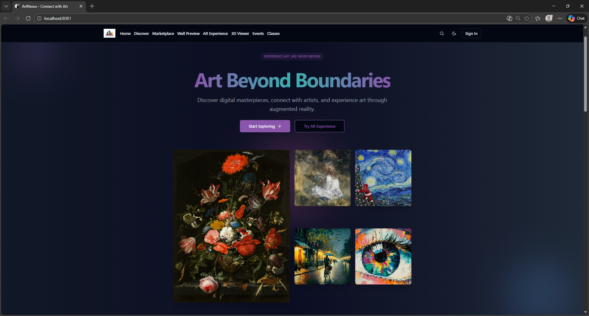
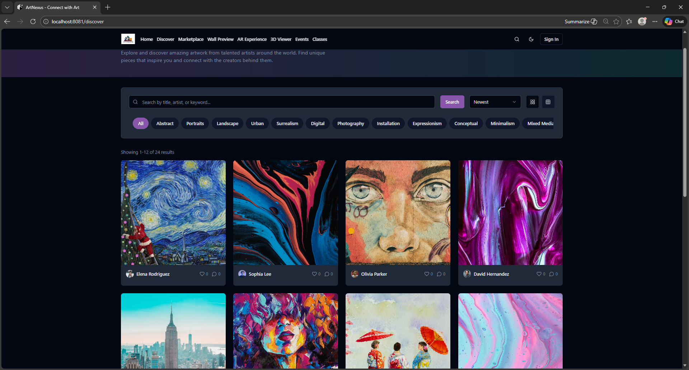
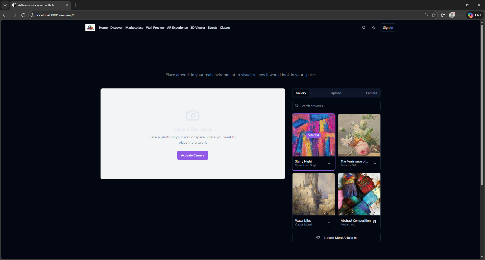
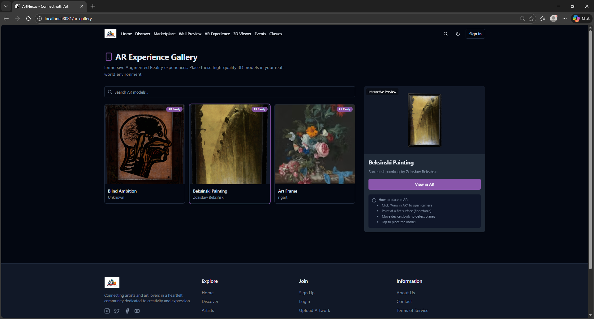
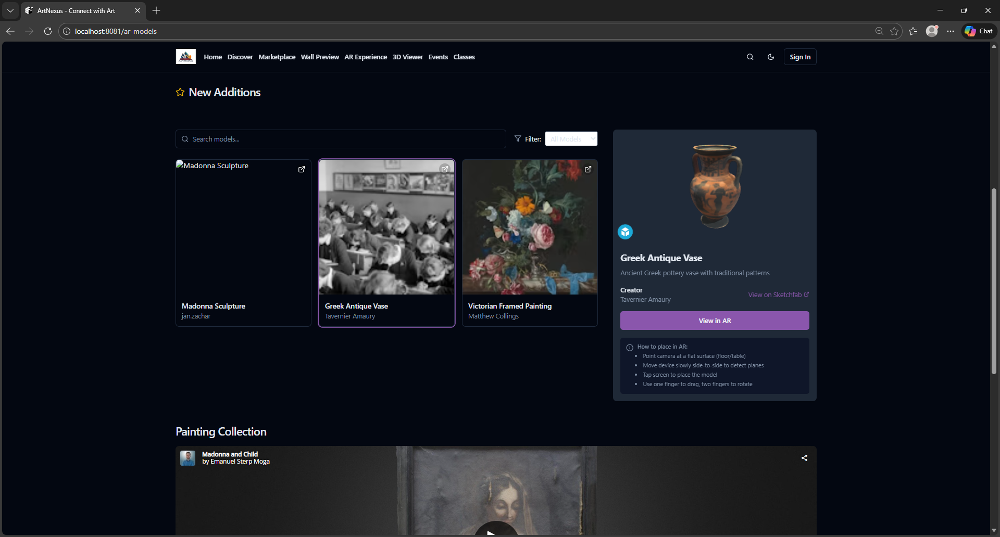
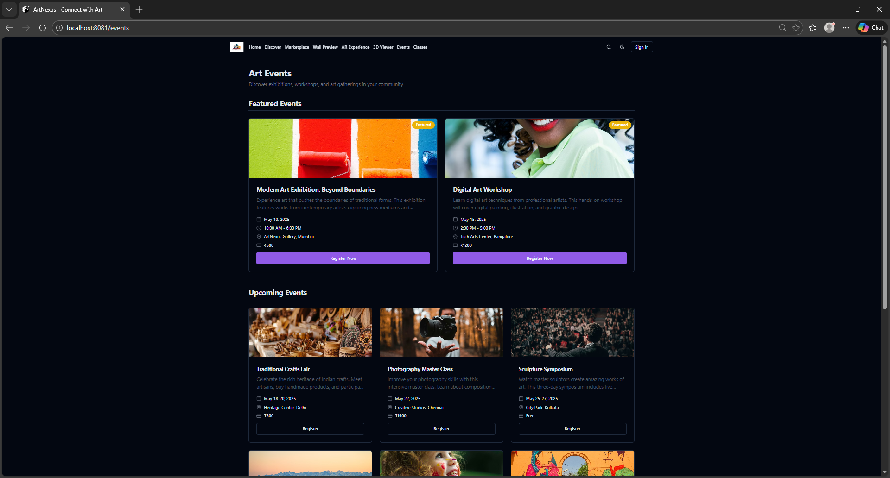
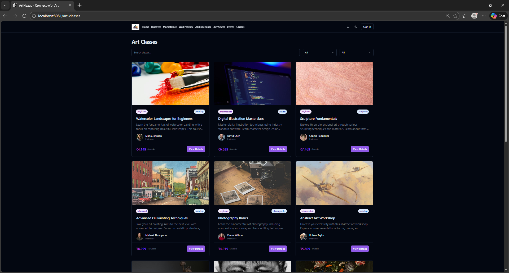

# ArtNexus 🎨

<<<<<<< HEAD

# 🎨 ArtNexus

**A Modern Art Discovery, Marketplace & Augmented Reality Platform**

[](https://reactjs.org/)
[](https://www.typescriptlang.org/)
[](https://vitejs.dev/)
[](https://supabase.com/)
[](https://tailwindcss.com/)
[](LICENSE)

[🌐 Live Demo](#) &nbsp;·&nbsp; [🐛 Report Bug](../../issues/new?template=bug_report.md) &nbsp;·&nbsp; [✨ Request Feature](../../issues/new?template=feature_request.md)

</div>
=======
Welcome to **ArtNexus** - a next-generation platform bridging the gap between traditional art and cutting-edge technology. Experience, collect, and interact with art like never before through our immersive features including Augmented Reality (AR) visualization, an interactive digital marketplace, AI-powered recommendations, and real-time artist analytics.
>>>>>>> 8a71776 (Production ready release)

---

## 🌟 Key Features

1. **Immersive AR Experiences**
   - **Wall Preview**: Visualize how artworks look on your own walls in real-time.
   - **3D Model Viewer**: Inspect sculptures and digital 3D models from every angle.
   - **AR Gallery Tour**: Walk through completely customized virtual museum spaces.

2. **Smart Digital Marketplace**
   - Curated fine arts, digital media, and simulated NFT assets side-by-side.
   - Advanced search, price filtering, and category sorting.
   - Full Shopping Cart & local-persistence Checkout system (orders appear in your Profile!).

3. **AI-Powered Discovery Engine**
   - An intelligent "Recommended For You" section that curates bespoke artwork suggestions dynamically in the Discovery tab.

4. **Artist Analytics Dashboard**
   - Comprehensive insights displaying generated revenue through interactive Recharts (Bar & Area graphs) and Key Performance Indicators (KPIs) for artists.

5. **Multi-Language Support (i18n)**
   - Seamless, un-refreshed switching between English (EN), French (FR), Spanish (ES), and Japanese (JA).

6. **Real-Time Social Elements**
   - Simulated live push notifications (e.g. "Your artwork just sold!").
   - Profile configurations showcasing purchased artwork, favorited pieces, and enrolled art masterclasses.

---

## 💻 Tech Stack

- **Framework**: [React 18](https://react.dev/) + [Vite](https://vitejs.dev/)
- **Language**: [TypeScript](https://www.typescriptlang.org/)
- **Styling**: [Tailwind CSS](https://tailwindcss.com/)
- **Components**: [shadcn/ui](https://ui.shadcn.com/) (Radix Primitives)
- **Icons**: [Lucide React](https://lucide.dev/)
- **Animations**: [Framer Motion](https://www.framer.com/motion/)
- **Data Fetching / State**: [TanStack React Query](https://tanstack.com/query/latest) & React Context API
- **Charts**: [Recharts](https://recharts.org/)

---

## 🚀 Getting Started Locally

To run the project locally, ensure you have Node.js installed, then follow these steps:

1. **Clone the repository:**
   ```bash
   git clone <your-repo-url>
   cd ArtNexus
   ```

2. **Install dependencies:**
   ```bash
   npm install
   ```

3. **Spin up the development server:**
   ```bash
   npm run dev
   ```
   > The app will typically be available at `http://localhost:8080`.

---

## 🌍 Deployment Guide

This project is perfectly optimized to be deployed to highly scalable Edge networks for free!

### Option 1: Vercel (Recommended for Best Performance)
1. Push this repository to your GitHub account.
2. Log into [Vercel](https://vercel.com).
3. Click **Add New Project** and select your `ArtNexus` repository.
4. Vercel will automatically detect that you are using Vite!
5. Leave the default settings (`Framework Preset: Vite`, `Build Command: npm run build`, `Output Directory: dist`) and click **Deploy**.

### Option 2: Netlify
1. Push this repository to your GitHub account.
2. Log into [Netlify](https://netlify.com).
3. Click **Add new site** -> **Import an existing project**.
4. Authorize your GitHub and select the `ArtNexus` repo.
5. Ensure the settings are:
   - Build command: `npm run build`
   - Publish directory: `dist`
6. Click **Deploy site**.

---

<<<<<<< HEAD
## 🚀 Getting Started

### Prerequisites

- [Node.js](https://nodejs.org/) ≥ 18
- [npm](https://www.npmjs.com/) ≥ 8
- A free [Supabase](https://supabase.com/) account

### 1. Clone & Install

```bash
git clone https://github.com/YOUR_USERNAME/ArtNexus.git
cd ArtNexus
npm install
```

### 2. Configure Environment Variables

```bash
cp .env.example .env
```

Edit `.env` and add your Supabase credentials:

```env
VITE_SUPABASE_URL=https://your-project-id.supabase.co
VITE_SUPABASE_ANON_KEY=your-anon-public-key
```

> Get these from: **Supabase Dashboard → Project Settings → API**

### 3. Set Up Supabase Database

Open the **SQL Editor** in your Supabase dashboard and run:

```sql
CREATE EXTENSION IF NOT EXISTS "uuid-ossp";

CREATE TABLE profiles (
  id UUID REFERENCES auth.users ON DELETE CASCADE PRIMARY KEY,
  username TEXT, avatar_url TEXT, bio TEXT, location TEXT, website TEXT,
  created_at TIMESTAMPTZ DEFAULT NOW(), updated_at TIMESTAMPTZ DEFAULT NOW()
);

CREATE TABLE artists (
  id UUID REFERENCES auth.users ON DELETE CASCADE PRIMARY KEY,
  name TEXT NOT NULL, bio TEXT, location TEXT, photo TEXT,
  verified BOOLEAN DEFAULT FALSE, created_at TIMESTAMPTZ DEFAULT NOW()
);

CREATE TABLE artworks (
  id UUID DEFAULT uuid_generate_v4() PRIMARY KEY,
  artist_id UUID REFERENCES artists(id) ON DELETE CASCADE,
  title TEXT NOT NULL, description TEXT, image TEXT NOT NULL,
  thumbnail TEXT, category TEXT[], price NUMERIC,
  for_sale BOOLEAN DEFAULT FALSE, likes INTEGER DEFAULT 0, views INTEGER DEFAULT 0,
  created_at TIMESTAMPTZ DEFAULT NOW(), updated_at TIMESTAMPTZ DEFAULT NOW()
);

CREATE TABLE collections (
  id UUID DEFAULT uuid_generate_v4() PRIMARY KEY,
  user_id UUID REFERENCES auth.users ON DELETE CASCADE,
  name TEXT NOT NULL, description TEXT, cover_image TEXT,
  created_at TIMESTAMPTZ DEFAULT NOW(), updated_at TIMESTAMPTZ DEFAULT NOW()
);

CREATE TABLE collection_items (
  id UUID DEFAULT uuid_generate_v4() PRIMARY KEY,
  collection_id UUID REFERENCES collections(id) ON DELETE CASCADE,
  artwork_id UUID REFERENCES artworks(id) ON DELETE CASCADE,
  created_at TIMESTAMPTZ DEFAULT NOW()
);
```

### 4. Enable Supabase Auth & Storage

- **Auth:** Dashboard → Authentication → Enable **Email/Password**
- **Storage:** Dashboard → Storage → Create bucket named `artworks` (Public)

### 5. Run the App

```bash
npm run dev
```

Open [http://localhost:8080](http://localhost:8080) 🎉

---

## ☁️ Deployment

### Netlify (Recommended — Free)

1. Push this repo to GitHub
2. Go to [netlify.com](https://netlify.com) → **Add new site** → **Import from Git**
3. Set build settings:
   - **Build command:** `npm run build`
   - **Publish directory:** `dist`
4. Add **Environment Variables** (`VITE_SUPABASE_URL`, `VITE_SUPABASE_ANON_KEY`)
5. Click **Deploy** ✅

> The `netlify.toml` in this repo auto-configures routing — no extra steps needed.

### Vercel (Free)

1. Go to [vercel.com](https://vercel.com) → **New Project** → Import your GitHub repo
2. Vercel auto-detects Vite. Add the same two env vars
3. Click **Deploy** ✅

### Manual Build

```bash
npm run build       # Outputs to dist/
npm run preview     # Preview locally before deploy
```

---

## 📜 Available Scripts

| Command | Description |
|---|---|
| `npm run dev` | Start dev server at `localhost:8080` |
| `npm run build` | Build for production → `dist/` |
| `npm run preview` | Preview production build locally |
| `npm run lint` | Run ESLint |

---
##Screenshots








## 🤝 Contributing

Contributions, issues and feature requests are welcome!  
See [CONTRIBUTING.md](CONTRIBUTING.md) for guidelines.

1. Fork the project
2. Create your branch: `git checkout -b feature/amazing-feature`
3. Commit: `git commit -m 'feat: add amazing feature'`
4. Push: `git push origin feature/amazing-feature`
5. Open a Pull Request

---

## � License

Distributed under the **MIT License**. See [LICENSE](LICENSE) for details.

---

<div align="center">
  <strong>Built with ❤️ by <a href="https://github.com/DevrajOO7">DEVRAJ</a></strong><br/>
  <sub>React · TypeScript · Vite · Supabase · TailwindCSS · WebXR</sub>
</div>
=======
*Developed by DEVRAJ &copy; 2025*
>>>>>>> 8a71776 (Production ready release)
